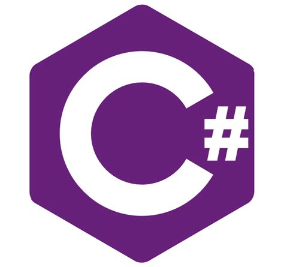
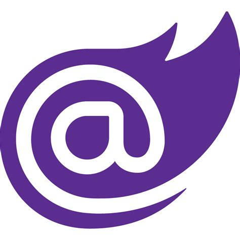
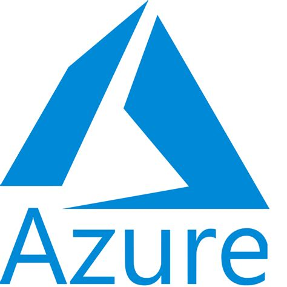
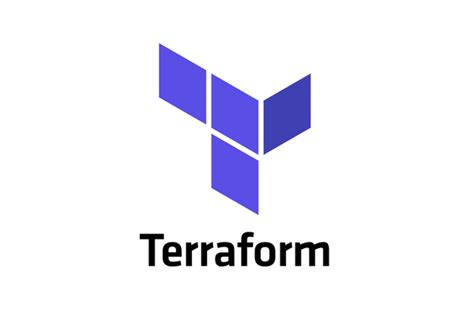
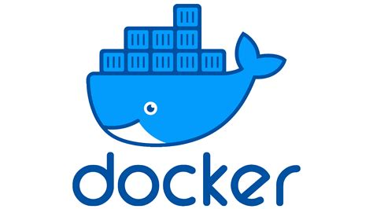
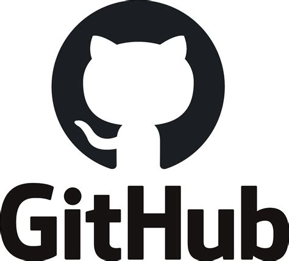
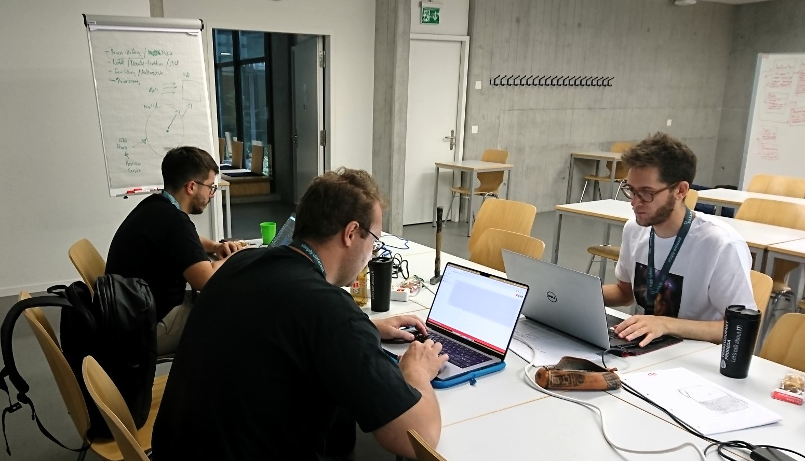
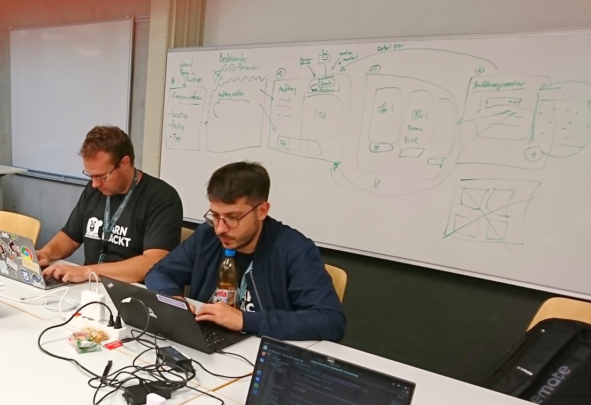

# Operation Thunderstorm Challenge Bärnhäckt 2023
___

## Aktueller Stand des Sourcecodes
[Github Link](https://github.com/ninomllr/bernhackt-2023 "link to github repo")

## Ausgangslage
Am diesjärigen BärnHäckt arbeitet Team **NOMNOMNOM** an der Challenge von GVB ([Challenge](https://www.bernhackt.ch/challenge-gvb-thunderstorm/ "challenge description")), um **GVB** bei einem Notfall helfen kann, Handwerker und betroffene Kunde zu matchen. Dies hilf, Folgeschäden und die resultierenden Kosten zu verhindern, sowie dem Kunden einen schnelleren Zugang zu Hilfe gewährzuleisten, und dabei die Handwerkbetriebe optimal auszulasten.

### Problembeschrieb
* Bei einem Notfall (zB Sturm) müssen viele Schäden an Gebäuden behoben werden
* Handwerker sind oft überlastet, andere finden keine Kunden
* Zusammenbringen der Kunden und Handwerker ist nicht einfach

### Fokus
MVP fokussiert sich auf Offerten mit Anreizen für Handwerker, um bei einem Notfall zu unterstützen.

### Technische Grundsatzentscheide
* Bewusster Entscheid gegen Mobile, da es ein Business Tool ist.
* Bewusst für Open Source entschieden
* Bewusst für Infrastructure as Code entschieden
* Entity Model First für das Datenmodell
* Eigenes AI Model, da out of the box nicht für unseren Use Case zugeschnitten

## Technischer Aufbau
### Komponente und Frameworks
| CODE         | DB     | INFRA |
|--------------|-----------|------------|
|    | in momory |    

### Aufgabe pro Tool
* Azure: Einfaches Hosting und Bereitstellen
* Docker: Container Umgebung
* Terraform: IaC
* Blazor: Frontend
* C# / .NET: Backend
* Leaflet: Maps
* Github Actions: CI / CD

## Implementation

### Lösung MVP
* [Finde unsere Lösung hier!](https://gvb-10534.azurewebsites.net/ "link to webpage")

### Out of Scope
* Auftrags- und Abrechnungstool für Handwerker

### Zukunftsplan
* Anbinden APIs (zB Wetterdaten) also Source für Notfall-Raduisberechnung

## Arbeitsverlauf

## Mitwirkende
Florence, Nico, Nino, Michal, Olivier
___

:heart: :house: :computer: :bear: :switzerland:
